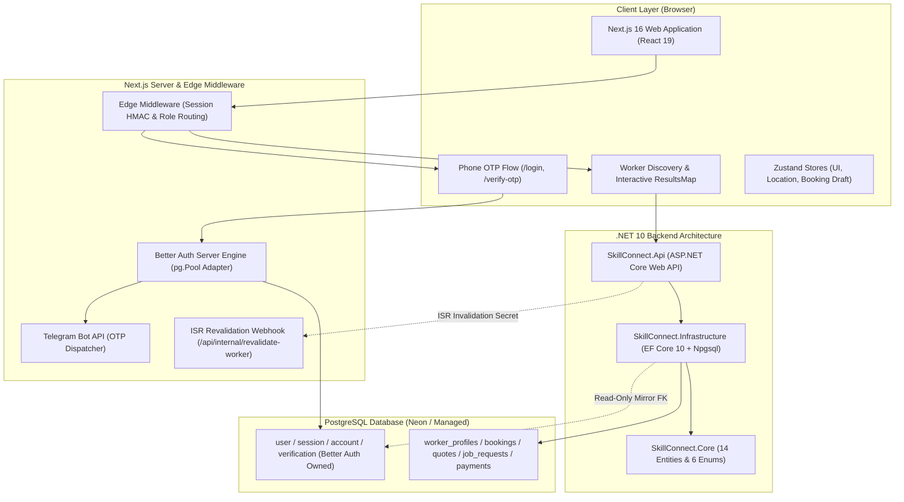

# SkillConnect Project Status & Architecture Analysis Report
**Date:** September 30, 2026  
**Workspace:** `Skill-connect`  
**Target Platform:** Web (Next.js 16 App Router) & Downstream .NET 10 API  
**Target Market:** Ethiopia (Localized for ETB Currency, Phone OTP Onboarding, and Regional Geolocation)

---

## 1. Executive Summary

**SkillConnect** is an on-demand marketplace designed to connect skilled tradespeople and technicians (plumbers, electricians, carpenters, painters, etc.) with customers and commercial clients in Ethiopia. 

The project employs a modern hybrid architecture:
- **Frontend / Edge Web Application**: Located at [`FrontEnd/Web`](file:///D:/VS/Skill-connect/FrontEnd/Web), built on **Next.js 16.3.5 (App Router)**, **React 19.2.8**, **Tailwind CSS v4**, **Better Auth 1.7.6**, **TanStack React Query v5**, **Zustand v5**, and **SignalR Client**.
- **Backend Core & Persistence**: Located at [`Backend/`](file:///D:/VS/Skill-connect/Backend), structured as a **.NET 10 (C# 13)** solution (`SkillConnect.slnx`) containing domain models, enums, EF Core 10 database configurations, and a PostgreSQL mapping layer.

---

## 2. High-Level Architecture Topology

---

## 3. Backend Implementation Analysis ([`Backend/`](file:///D:/VS/Skill-connect/Backend))

The .NET 10 solution file ([`SkillConnect.slnx`](file:///D:/VS/Skill-connect/Backend/SkillConnect.slnx)) compiles cleanly with **0 errors**.

### 3.1 Domain Model ([`SkillConnect.Core`](file:///D:/VS/Skill-connect/Backend/SkillConnect.Core))
Houses pure business entities and enums decoupled from any external database libraries:

* **Identity Mirroring**:
  * [`AppUser.cs`](file:///D:/VS/Skill-connect/Backend/SkillConnect.Core/Entities/AppUser.cs): Mirrors Better Auth's `user` table. Maps Better Auth string UUID `id`, `email`, `phoneNumber`, `role`, and timestamps for foreign-key navigations.
* **Worker & Catalog Management**:
  * [`WorkerProfile.cs`](file:///D:/VS/Skill-connect/Backend/SkillConnect.Core/Entities/WorkerProfile.cs): Holds professional profile details, category slugs (`CategoryIds`), rating averages, completed job count, verified status, service radius (km), and coordinate fields (`LocationLat`, `LocationLng`).
  * [`Category.cs`](file:///D:/VS/Skill-connect/Backend/SkillConnect.Core/Entities/Category.cs): Service categories (slug, name, icon).
  * [`PortfolioItem.cs`](file:///D:/VS/Skill-connect/Backend/SkillConnect.Core/Entities/PortfolioItem.cs): Image/media showcase items associated with a worker.
* **Job Request, Quotation & Booking Lifecycle**:
  * [`JobRequest.cs`](file:///D:/VS/Skill-connect/Backend/SkillConnect.Core/Entities/JobRequest.cs): Customer-submitted job with geographic location, address, category, and status.
  * [`Quote.cs`](file:///D:/VS/Skill-connect/Backend/SkillConnect.Core/Entities/Quote.cs): Worker bid submitted against a job request with Ethiopian Birr pricing (`Currency = "ETB"`), optional message, and expiration timestamp.
  * [`Booking.cs`](file:///D:/VS/Skill-connect/Backend/SkillConnect.Core/Entities/Booking.cs): Confirmed engagement with check-in, check-out, and completion timestamps, linking directly to quotes, reviews, chat threads, and payments.
* **Financial & Trust Infrastructure**:
  * [`PaymentRecord.cs`](file:///D:/VS/Skill-connect/Backend/SkillConnect.Core/Entities/PaymentRecord.cs): Tracks transactions in ETB, payment providers (Telebirr, Chapa, CBE Birr), and settlement states.
  * [`VerificationSubmission.cs`](file:///D:/VS/Skill-connect/Backend/SkillConnect.Core/Entities/VerificationSubmission.cs): National ID / trade license verification submissions for admin approval.
  * [`Dispute.cs`](file:///D:/VS/Skill-connect/Backend/SkillConnect.Core/Entities/Dispute.cs): Customer or worker dispute claim handling.
  * [`Review.cs`](file:///D:/VS/Skill-connect/Backend/SkillConnect.Core/Entities/Review.cs): Rating (1–5) and customer feedback.
* **Communication**:
  * [`ChatThread.cs`](file:///D:/VS/Skill-connect/Backend/SkillConnect.Core/Entities/ChatThread.cs), [`Message.cs`](file:///D:/VS/Skill-connect/Backend/SkillConnect.Core/Entities/Message.cs), [`Notification.cs`](file:///D:/VS/Skill-connect/Backend/SkillConnect.Core/Entities/Notification.cs).
* **Domain Enums ([`SkillConnect.Core/Enums`](file:///D:/VS/Skill-connect/Backend/SkillConnect.Core/Enums))**:
  * [`UserRole.cs`](file:///D:/VS/Skill-connect/Backend/SkillConnect.Core/Enums/UserRole.cs) (`Customer`, `Worker`, `Admin`)
  * [`BookingStatus.cs`](file:///D:/VS/Skill-connect/Backend/SkillConnect.Core/Enums/BookingStatus.cs) (`Confirmed`, `InProgress`, `Completed`, `Cancelled`)
  * [`JobRequestStatus.cs`](file:///D:/VS/Skill-connect/Backend/SkillConnect.Core/Enums/JobRequestStatus.cs) (`Open`, `Quoted`, `Assigned`, `Closed`, `Cancelled`)
  * [`QuoteStatus.cs`](file:///D:/VS/Skill-connect/Backend/SkillConnect.Core/Enums/QuoteStatus.cs) (`Pending`, `Accepted`, `Rejected`, `Expired`)
  * [`PaymentStatus.cs`](file:///D:/VS/Skill-connect/Backend/SkillConnect.Core/Enums/PaymentStatus.cs) (`Pending`, `Held`, `Released`, `Refunded`, `Failed`)
  * [`VerificationStatus.cs`](file:///D:/VS/Skill-connect/Backend/SkillConnect.Core/Enums/VerificationStatus.cs) (`Pending`, `Approved`, `Rejected`)

### 3.2 Persistence Layer ([`SkillConnect.Infrastructure`](file:///D:/VS/Skill-connect/Backend/SkillConnect.Infrastructure))
* **Database Context**: [`AppDbContext.cs`](file:///D:/VS/Skill-connect/Backend/SkillConnect.Infrastructure/Persistence/AppDbContext.cs) manages 13 domain entity sets and 1 read-only mirror entity (`Users`). Automatically scans and applies configuration classes from assembly reflection.
* **Fluent API Configurations ([`Persistence/Configurations`](file:///D:/VS/Skill-connect/Backend/SkillConnect.Infrastructure/Persistence/Configurations))**:
  * [`AppUserConfiguration.cs`](file:///D:/VS/Skill-connect/Backend/SkillConnect.Infrastructure/Persistence/Configurations/AppUserConfiguration.cs): Maps the lowercase `user` table owned by Better Auth, maintaining string conversions for roles and unique index constraints on email and phone.
  * [`WorkerProfileConfiguration.cs`](file:///D:/VS/Skill-connect/Backend/SkillConnect.Infrastructure/Persistence/Configurations/WorkerProfileConfiguration.cs): Foreign key to `user.id`, precision configuration on ratings, and cascade rules for portfolio items and verification files.
  * [`BookingConfiguration.cs`](file:///D:/VS/Skill-connect/Backend/SkillConnect.Infrastructure/Persistence/Configurations/BookingConfiguration.cs): Enforces foreign key constraints for quotes, customers, workers, 1:1 chat thread bindings, and payment records.
  * Complete configurations for [`JobRequest`](file:///D:/VS/Skill-connect/Backend/SkillConnect.Infrastructure/Persistence/Configurations/JobRequestConfiguration.cs), [`PaymentRecord`](file:///D:/VS/Skill-connect/Backend/SkillConnect.Infrastructure/Persistence/Configurations/PaymentRecordConfiguration.cs), [`Quote`](file:///D:/VS/Skill-connect/Backend/SkillConnect.Infrastructure/Persistence/Configurations/QuoteConfiguration.cs), [`VerificationSubmission`](file:///D:/VS/Skill-connect/Backend/SkillConnect.Infrastructure/Persistence/Configurations/VerificationSubmissionConfiguration.cs), and [`Dispute`](file:///D:/VS/Skill-connect/Backend/SkillConnect.Infrastructure/Persistence/Configurations/DisputeConfiguration.cs).

### 3.3 API Host ([`SkillConnect.Api`](file:///D:/VS/Skill-connect/Backend/SkillConnect.Api))
* Currently in bootstrap state with standard template routes ([`Program.cs`](file:///D:/VS/Skill-connect/Backend/SkillConnect.Api/Program.cs)). Ready for endpoint controllers, SignalR hubs, and JWT bearer authentication middleware.

---

## 4. Frontend Web Architecture ([`FrontEnd/Web/`](file:///D:/VS/Skill-connect/FrontEnd/Web))

The web client is built with Next.js 16.3.5 and React 19.2.8, adhering to strict server/client component boundaries and zero-trust security practices.

### 4.1 Authentication & Security Engine
* **Better Auth Server Setup ([`auth-server.ts`](file:///D:/VS/Skill-connect/FrontEnd/Web/src/lib/auth-server.ts))**:
  * Connected to PostgreSQL using node `pg.Pool`.
  * **Phone OTP Plugin**: Enables seamless phone-based passwordless signup and login.
  * **Telegram Bot Dispatcher**: When OTP codes are generated, [`sendTelegramMessage()`](file:///D:/VS/Skill-connect/FrontEnd/Web/src/lib/auth-server.ts#L11) dispatches the 6-digit OTP code directly to a designated Telegram channel/bot chat via the Telegram Bot API (`TELEGRAM_BOT_TOKEN`, `TELEGRAM_CHAT_ID`), eliminating reliance on paid SMS gateways during development while remaining swappable via [`setSmsDispatcher()`](file:///D:/VS/Skill-connect/FrontEnd/Web/src/lib/auth-server.ts#L55).
  * **Ethiopian Phone Normalizer**: [`normalizePhoneForTempEmail()`](file:///D:/VS/Skill-connect/FrontEnd/Web/src/lib/auth-server.ts#L63) reconciles both `0911...` (local 10 digits) and `+251911...` into unified internal IDs.
  * **Downstream JWT Minting**: Issues short-lived (15-minute) signed JWTs configured with issuer `skill-connect` and audience `skill-connect-api` containing user ID, role, session ID, and phone number for downstream .NET API calls.
  * **Rate Limiting**: Strictly protects against OTP brute force (3 send attempts/min, 5 verification attempts/min).
* **Hardened API Client ([`api-client.ts`](file:///D:/VS/Skill-connect/FrontEnd/Web/src/lib/api-client.ts))**:
  * **In-Memory JWT Access Storage**: Access tokens are kept exclusively in private module memory ([`inMemoryAccessToken`](file:///D:/VS/Skill-connect/FrontEnd/Web/src/lib/api-client.ts#L161)), shielding the application against persistent token theft via `localStorage` XSS attacks.
  * **Silent 401 Re-acquisition**: On `401 Unauthorized` responses from the downstream C# backend, automatically re-mints a fresh JWT from Better Auth's HTTP-only session cookie and retries the failed request once before failing.
  * **RFC 7807 Problem Details**: Implements [`ApiError`](file:///D:/VS/Skill-connect/FrontEnd/Web/src/lib/api-client.ts#L36) for structured server error feedback.
* **Edge Middleware ([`middleware.ts`](file:///D:/VS/Skill-connect/FrontEnd/Web/src/middleware.ts))**:
  * Performs edge session verification via HMAC signature checks on Better Auth session cookie caches.
  * Restricts routes by role:
    * **Admin Routes**: `/verification-queue`, `/disputes`, `/admin`
    * **Worker Routes**: `/dashboard`, `/jobs`, `/earnings`, `/schedule`
    * **Customer Routes**: `/bookings`, `/saved-workers`
    * **Shared Protected**: `/chat`, `/profile`, `/settings`
    * **Guest Only**: `/login`, `/verify-otp` (authenticated users automatically redirect to their respective role landing page).
  * Sanitizes redirect parameters via [`getSafeCallbackUrl()`](file:///D:/VS/Skill-connect/FrontEnd/Web/src/middleware.ts) to guard against open-redirect exploits.
* **Auth UI Flow**:
  * [`/login`](file:///D:/VS/Skill-connect/FrontEnd/Web/src/app/(auth)/login/page.tsx): E.164 phone entry with instant feedback and Telegram OTP delivery advisory.
  * [`/verify-otp`](file:///D:/VS/Skill-connect/FrontEnd/Web/src/app/(auth)/verify-otp/page.tsx): Formatted 6-digit input, 30-second cooldown resend mechanism, masked phone display, and intelligent post-login redirection.

### 4.2 Discovery & Search Feature ([`features/discovery/`](file:///D:/VS/Skill-connect/FrontEnd/Web/src/features/discovery))
* **Zod Schemas ([`discovery/schema.ts`](file:///D:/VS/Skill-connect/FrontEnd/Web/src/features/discovery/schema.ts))**:
  * [`searchFiltersSchema`](file:///D:/VS/Skill-connect/FrontEnd/Web/src/features/discovery/schema.ts#L60): Coordinates, radius (km), category, availability (`available_now`, `today`, `this_week`), rating, price range, verification status, and sorting.
  * [`workerSummarySchema`](file:///D:/VS/Skill-connect/FrontEnd/Web/src/features/discovery/schema.ts#L110): Detailed worker metadata, hourly pricing, ratings, completed jobs, verification tier, and languages.
* **Search Hooks & API**:
  * [`searchWorkers()`](file:///D:/VS/Skill-connect/FrontEnd/Web/src/features/discovery/api.ts#L36): Encodes query parameters and communicates with the backend search endpoint.
  * [`useSearchWorkers()`](file:///D:/VS/Skill-connect/FrontEnd/Web/src/features/discovery/hooks/useSearchWorkers.ts): TanStack Query hook with automated stale-time caching and filter isolation.
* **Discovery UI Components**:
  * [`WorkerCard.tsx`](file:///D:/VS/Skill-connect/FrontEnd/Web/src/features/discovery/components/WorkerCard.tsx): Displays worker avatar with initials fallback, live availability status dot, verification badge, distance calculator, skills, and direct action triggers.
  * [`ResultsMap.tsx`](file:///D:/VS/Skill-connect/FrontEnd/Web/src/features/discovery/components/ResultsMap.tsx): Interactive map canvas featuring origin radar sweeps, radius halos, custom price marker pins, and interactive selection cards.
* **Edge ISR Revalidation Route ([`revalidate-worker/route.ts`](file:///D:/VS/Skill-connect/FrontEnd/Web/src/app/api/internal/revalidate-worker/route.ts))**:
  * Protected by secret token (`x-revalidation-secret`), allowing backend worker profile updates to trigger on-demand cache revalidation for `/workers/[id]` and tag `worker-[id]`.

### 4.3 Design System & Layout Chrome
* **Tokens & Theme ([`tokens.ts`](file:///D:/VS/Skill-connect/FrontEnd/Web/src/lib/tokens.ts))**:
  * Standardized color palette with primary blues, brand amber accents, emerald success, and neutral grays configured for Tailwind CSS v4.
* **UI Primitives ([`components/ui/`](file:///D:/VS/Skill-connect/FrontEnd/Web/src/components/ui))**:
  * [`Button.tsx`](file:///D:/VS/Skill-connect/FrontEnd/Web/src/components/ui/Button.tsx), [`Input.tsx`](file:///D:/VS/Skill-connect/FrontEnd/Web/src/components/ui/Input.tsx), [`Select.tsx`](file:///D:/VS/Skill-connect/FrontEnd/Web/src/components/ui/Select.tsx), [`Badge.tsx`](file:///D:/VS/Skill-connect/FrontEnd/Web/src/components/ui/Badge.tsx), [`Modal.tsx`](file:///D:/VS/Skill-connect/FrontEnd/Web/src/components/ui/Modal.tsx), [`Skeleton.tsx`](file:///D:/VS/Skill-connect/FrontEnd/Web/src/components/ui/Skeleton.tsx).
* **Feedback Components ([`components/feedback/`](file:///D:/VS/Skill-connect/FrontEnd/Web/src/components/feedback))**:
  * [`Toast.tsx`](file:///D:/VS/Skill-connect/FrontEnd/Web/src/components/feedback/Toast.tsx), [`ErrorBoundary.tsx`](file:///D:/VS/Skill-connect/FrontEnd/Web/src/components/feedback/ErrorBoundary.tsx), [`EmptyState.tsx`](file:///D:/VS/Skill-connect/FrontEnd/Web/src/components/feedback/EmptyState.tsx).
* **Layout Structure ([`components/layout/`](file:///D:/VS/Skill-connect/FrontEnd/Web/src/components/layout))**:
  * [`AppShell.tsx`](file:///D:/VS/Skill-connect/FrontEnd/Web/src/components/layout/AppShell.tsx): Server component wrapper managing responsive sidebars, header navigation, and client feedback portals.
  * [`RoleSidebar.tsx`](file:///D:/VS/Skill-connect/FrontEnd/Web/src/components/layout/RoleSidebar.tsx): Dynamically updates navigation items based on active role (`Customer`, `Worker`, `Admin`).
  * [`Header.tsx`](file:///D:/VS/Skill-connect/FrontEnd/Web/src/components/layout/Header.tsx), [`Navbar.tsx`](file:///D:/VS/Skill-connect/FrontEnd/Web/src/components/layout/Navbar.tsx), [`Footer.tsx`](file:///D:/VS/Skill-connect/FrontEnd/Web/src/components/layout/Footer.tsx).
  * [`page.tsx`](file:///D:/VS/Skill-connect/FrontEnd/Web/src/app/page.tsx): Home landing page integrating [`Hero.tsx`](file:///D:/VS/Skill-connect/FrontEnd/Web/src/components/home/Hero.tsx) and [`StatStrip.tsx`](file:///D:/VS/Skill-connect/FrontEnd/Web/src/components/home/StatStrip.tsx).

### 4.4 Client State Management & Real-time Connectivity
* [`uiStore.ts`](file:///D:/VS/Skill-connect/FrontEnd/Web/src/state/store/uiStore.ts): Decoupled UI state (notifications/toasts, modal dialog controls, responsive sidebar toggle, full-page loading indicators).
* [`locationStore.ts`](file:///D:/VS/Skill-connect/FrontEnd/Web/src/state/store/locationStore.ts): Persists user search center, geolocation coordinates, search radius, and recent search locations (capped at 5 in `localStorage`). Defaults to Addis Ababa locations (e.g., *"Bole, Addis Ababa"*).
* [`bookingDraftStore.ts`](file:///D:/VS/Skill-connect/FrontEnd/Web/src/state/store/bookingDraftStore.ts): 5-step customer booking wizard persisted in `sessionStorage` (worker selection, date/slot, location & gate codes, attachments, price estimation).
* [`SocketProvider.tsx`](file:///D:/VS/Skill-connect/FrontEnd/Web/src/state/context/SocketProvider.tsx): React context managing real-time SignalR WebSocket connectivity, automatic reconnects, and token injection via Better Auth.
* [`queryClient.ts`](file:///D:/VS/Skill-connect/FrontEnd/Web/src/state/query/queryClient.ts) & [`queryKeys.ts`](file:///D:/VS/Skill-connect/FrontEnd/Web/src/state/query/queryKeys.ts): TanStack Query configuration with 401 non-retryable error handling, stale time defaults, and hierarchical query keys.

---

## 5. Automated Test Coverage ([`FrontEnd/Web/tests`](file:///D:/VS/Skill-connect/FrontEnd/Web/tests))

The project features a suite of **34 unit and integration test suites** containing **473 test cases** executed via Jest and Testing Library:

- **Core Security & API Client**: Token caching, retry suppression on 403, 401 re-acquisition, Problem Details parsing, and AbortSignal timeout management ([`api-client.test.ts`](file:///D:/VS/Skill-connect/FrontEnd/Web/tests/unit/api-client.test.ts)).
- **Auth Server & Client**: Rate limiting verification, phone normalization, trusted origins validation, and session type inference ([`auth-server.test.ts`](file:///D:/VS/Skill-connect/FrontEnd/Web/tests/unit/auth-server.test.ts), [`auth-client.test.ts`](file:///D:/VS/Skill-connect/FrontEnd/Web/tests/unit/auth-client.test.ts)).
- **Edge Routing & Middleware**: Protected path enforcement, role-based redirection, cookie HMAC validation, and callback URL protection ([`middleware.test.ts`](file:///D:/VS/Skill-connect/FrontEnd/Web/tests/unit/middleware.test.ts)).
- **State Stores**: State transitions, boundary validations, and storage persistence for UI, Location, and Booking Draft stores ([`ui-store.test.ts`](file:///D:/VS/Skill-connect/FrontEnd/Web/tests/unit/ui-store.test.ts), [`location-store.test.ts`](file:///D:/VS/Skill-connect/FrontEnd/Web/tests/unit/location-store.test.ts), [`booking-draft-store.test.ts`](file:///D:/VS/Skill-connect/FrontEnd/Web/tests/unit/booking-draft-store.test.ts)).
- **Discovery Components**: Snapshot and interaction tests for `WorkerCard`, `ResultsMap`, and query hooks ([`worker-card.test.tsx`](file:///D:/VS/Skill-connect/FrontEnd/Web/tests/unit/worker-card.test.tsx), [`results-map.test.tsx`](file:///D:/VS/Skill-connect/FrontEnd/Web/tests/unit/results-map.test.tsx)).

---

## 6. Implementation Status Matrix

| Module / Feature | Subcomponent | Status | Implementation Details |
| :--- | :--- | :--- | :--- |
| **Backend Core** | Domain Entities | **Complete** | 14 entities in [`SkillConnect.Core`](file:///D:/VS/Skill-connect/Backend/SkillConnect.Core) |
| **Backend Core** | Domain Enums | **Complete** | 6 enums (UserRole, BookingStatus, etc.) |
| **Backend Persistence** | EF Core 10 DbContext | **Complete** | [`AppDbContext.cs`](file:///D:/VS/Skill-connect/Backend/SkillConnect.Infrastructure/Persistence/AppDbContext.cs) with dynamic configurations |
| **Backend Persistence** | Entity Configurations | **Complete** | 14 Fluent API configurations mapping tables & FKs |
| **Backend API** | Controllers & Endpoints | **Pending** | [`Program.cs`](file:///D:/VS/Skill-connect/Backend/SkillConnect.Api/Program.cs) currently minimal bootstrap |
| **Backend API** | SignalR Hubs | **Pending** | Hubs for real-time chat and notifications |
| **Frontend Auth** | Phone OTP Engine | **Complete** | Better Auth + Telegram Bot OTP delivery |
| **Frontend Auth** | In-Memory JWT Security | **Complete** | Strictly in-memory JWT with 401 auto re-minting |
| **Frontend Auth** | Edge Middleware | **Complete** | Role routing & session cookie HMAC validation |
| **Frontend Auth** | Auth UI Pages | **Complete** | [`/login`](file:///D:/VS/Skill-connect/FrontEnd/Web/src/app/(auth)/login/page.tsx) and [`/verify-otp`](file:///D:/VS/Skill-connect/FrontEnd/Web/src/app/(auth)/verify-otp/page.tsx) |
| **Frontend Discovery**| Schemas & Queries | **Complete** | [`discovery/schema.ts`](file:///D:/VS/Skill-connect/FrontEnd/Web/src/features/discovery/schema.ts) & [`useSearchWorkers`](file:///D:/VS/Skill-connect/FrontEnd/Web/src/features/discovery/hooks/useSearchWorkers.ts) |
| **Frontend Discovery**| WorkerCard & ResultsMap | **Complete** | Vector map canvas and worker cards with badges |
| **Frontend Discovery**| ISR Revalidation Webhook| **Complete** | [`/api/internal/revalidate-worker`](file:///D:/VS/Skill-connect/FrontEnd/Web/src/app/api/internal/revalidate-worker/route.ts) |
| **Frontend Design** | Design Tokens & CSS | **Complete** | Tailwind CSS v4 brand palette in [`tokens.ts`](file:///D:/VS/Skill-connect/FrontEnd/Web/src/lib/tokens.ts) |
| **Frontend Design** | Layout Chrome | **Complete** | `AppShell`, `RoleSidebar`, `Header`, `Navbar`, `Footer` |
| **Frontend State** | UI & Location Stores | **Complete** | Toast/modal control & persisted search radius/coords |
| **Frontend State** | Booking Draft Store | **Complete** | 5-step wizard store with `sessionStorage` persistence |
| **Frontend State** | Real-time SignalR | **Complete** | [`SocketProvider.tsx`](file:///D:/VS/Skill-connect/FrontEnd/Web/src/state/context/SocketProvider.tsx) with token lifecycle factory |
| **Frontend Features**| Booking Flow UI | **Scaffolded** | Store ready; schemas and pages pending |
| **Frontend Features**| Worker Profile Page | **Scaffolded** | ISR revalidation route ready; public page pending |
| **Frontend Features**| Chat & Messaging | **Scaffolded** | SignalR socket provider ready; schemas/UI pending |
| **Frontend Features**| Payments & Disputes | **Scaffolded** | Backend entities ready; frontend client pending |

---

## 7. Recommended Next Steps

1. **Backend Database Migrations & Controllers ([`SkillConnect.Api`](file:///D:/VS/Skill-connect/Backend/SkillConnect.Api))**:
   - Add PostgreSQL connection string to `appsettings.json`.
   - Run EF Core initial migration (`dotnet ef migrations add InitialCreate`).
   - Configure ASP.NET Core JWT authentication middleware to validate tokens signed by Better Auth.
   - Implement controller endpoints: `GET /api/workers/search`, `GET /api/workers/{id}`, `POST /api/bookings`.
2. **Booking Wizard UI Flow**:
   - Implement the multi-step booking page route (`/book/[workerId]`) utilizing [`bookingDraftStore.ts`](file:///D:/VS/Skill-connect/FrontEnd/Web/src/state/store/bookingDraftStore.ts).
3. **Public Worker Profile Page**:
   - Build `/workers/[id]` with Incremental Static Regeneration (ISR) and connection to the revalidation route.
4. **Role Dashboards**:
   - Construct `/dashboard` (Worker), `/bookings` (Customer), and `/verification-queue` (Admin).
5. **Real-time SignalR Hubs**:
   - Add `ChatHub` and `NotificationHub` in ASP.NET Core to connect with [`SocketProvider.tsx`](file:///D:/VS/Skill-connect/FrontEnd/Web/src/state/context/SocketProvider.tsx).
